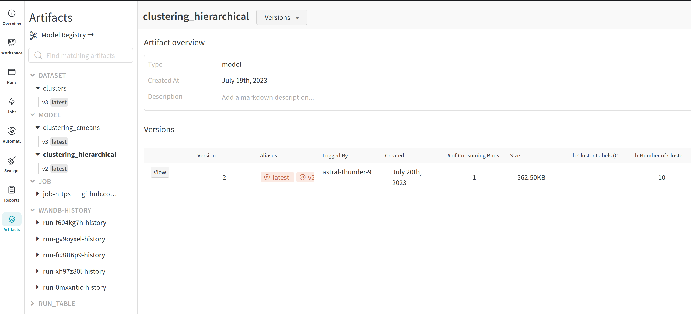
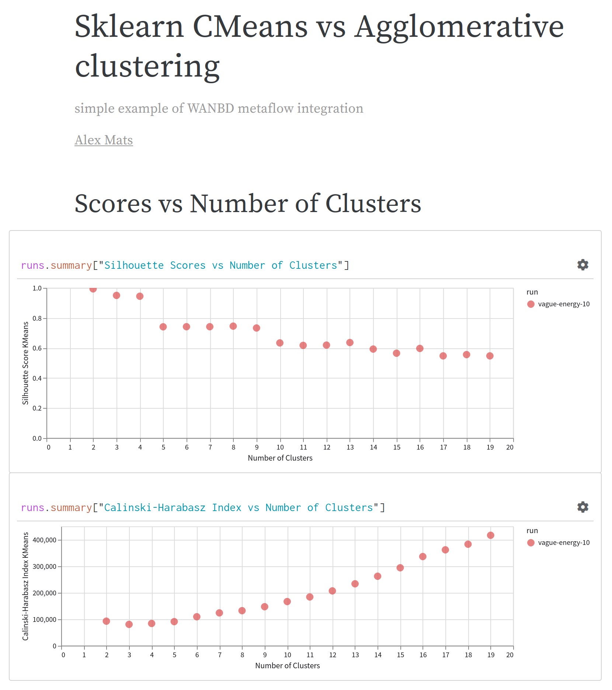
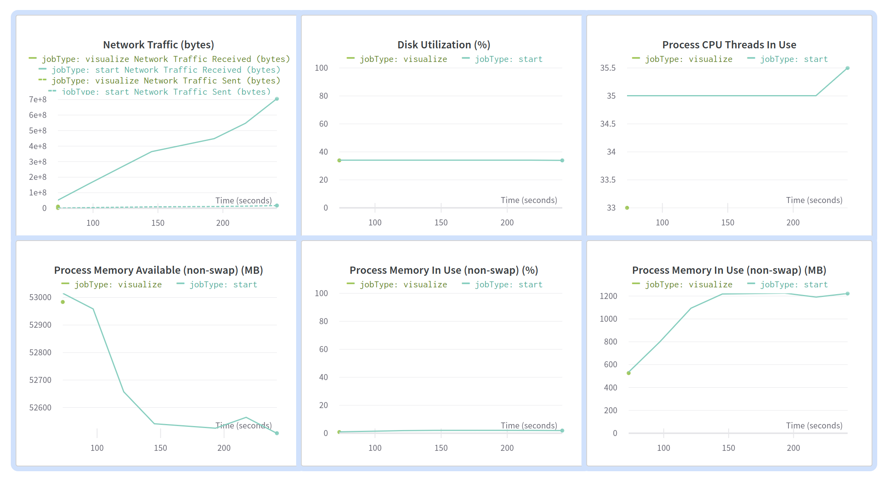
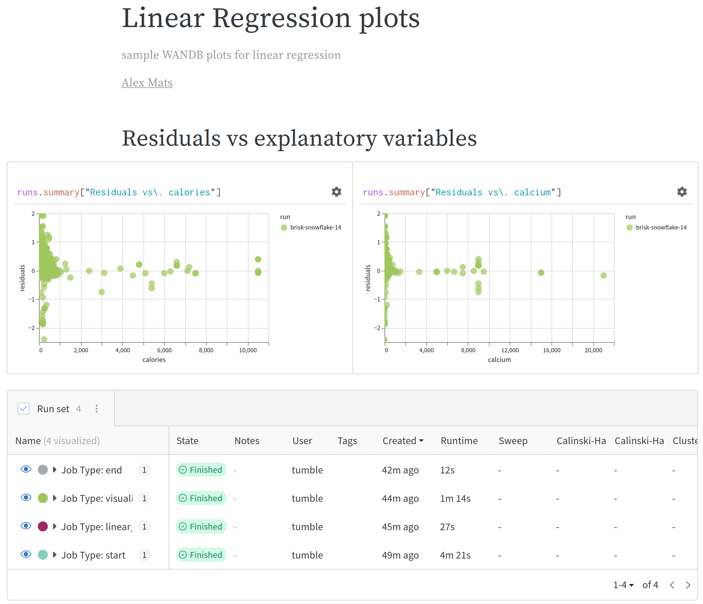
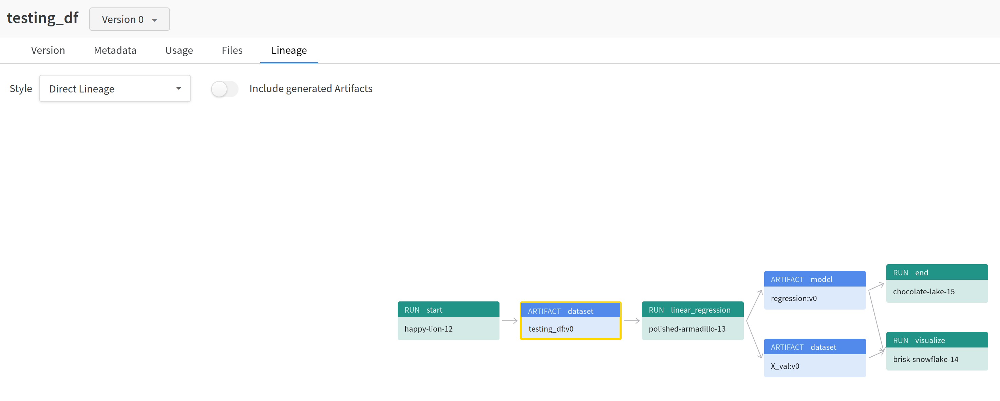

### create new s3 bucket: mlops-nutrients (already created in ap-southeast-1) with the following 
### bucket access policy - DON"T FORGET TO SPECIFY YOUR OWN PRINCIPLE ACCOUNTS! to use a bucket for read/write.
### reading from mlops-nutrients bucket is allowed to anyone at the moment

{
    "Version": "2012-10-17",
    "Statement": [
        {
            "Sid": "AllowListAccess",
            "Effect": "Allow",
            "Principal": "*",
            "Action": "s3:ListBucket",
            "Resource": "arn:aws:s3:::mlops-nutrients"
        },
        {
            "Sid": "AllowReadAccess",
            "Effect": "Allow",
            "Principal": "*",
            "Action": [
                "s3:GetObject",
                "s3:GetObjectVersion"
            ],
            "Resource": "arn:aws:s3:::mlops-nutrients/*"
        },
        {
            "Sid": "AllowWriteAccess",
            "Effect": "Allow",
            "Principal": {
                "AWS": [
                    "arn:aws:iam::388062344663:user/awsworker",
                    "arn:aws:iam::388062344663:user/arybach"
                ]
            },
            "Action": [
                "s3:PutObject",
                "s3:DeleteObject",
                "s3:PutObjectAcl",
                "s3:DeleteObjectVersion",
                "s3:PutObjectVersionAcl"
            ],
            "Resource": "arn:aws:s3:::mlops-nutrients/*"
        }
    ]
}

#### make sure that all envs are exported either in the terminal or ~/.bashrs file - besides being added to vault, region should be without quotes
```export AWS_ACCESS_KEY_ID="XXXXXXXXXXXXXXXXX"
```export AWS_SECRET_ACCESS_KEY="XXXXXXXXXXXXXXXXXX"
```export AWS_REGION=ap-southeast-1
```export OPENAI_API_KEY="XXXXXXXXXXXXXXXXXXXXXXXXXX"
```export HUGGING_FACE_TOKEN="XXXXXXXXXXXXXXXXXXXXXXXXXXXX"
```export ES_PASSWORD="XXXXXXXXXXXXXXXXXXXXXXXX"
```export USDA_API_KEY="XXXXXXXXXXXXXXXXXXXXXXXXXXXXXX"
```export WANDB_API_KEY="XXXXXXXXXXXXXXXXXXXXXXXXXXX"

in the config.py file specify your own s3 bucket name, es index, model name, es host (local or cloud - by default local is used. search and replace to change for cloud, but additional en var will be needed) 

bucket_name='mlops-nutrients'
index='nutrients'
model="msmarco"
es_local_host="18.143.34.247"
es_cloud_host="elastic.es.us-central1.gcp.cloud.es.io"

### Run extra flows (not-required):
* #### to fetch pre-processed data from s3 and save as metaflow artifacts
```python3 sf_usda_flow.py run 
* #### to fetch archived .parquet file from mlops-nutrients bucket and add enrich docs missing from the elasticserach index with direct calls to usda api (VERY SLOW due to api rate limits!!! - can be interrupted at any time and resumed later)
```python3 sf_usda_to_es_flow.py run 
* #### export docs from nutrients index to s3://mlops-nutrients/nutrients/nutrients.parquet (only need to run after sf_usda_to_es_flow.py)
```python3 sf_export_docs_to_s3_flow.py run

### Run required flows:
* #### to fetch all archived docs from s3://mlops-nutrients/nutrients/nutrients.parquet - label as training, validation and testing and save to labeled index in elsaticsearch 
```python3 sf_split_dataset_flow.py run
* #### to clusterize all docs in labeled index and save models to s3://mlops-nutrients/models
```python3 sf_es_clusters_flow.py run
#### the card saves details of the model run - run command below to view in the browser (clusters.html file contains an example output):
```python3 sf_es_clusters_flow.py card view visualize_training
```python3 sf_es_clusters_flow.py card view validate
#### card view step_name command is needed to view each step in the flow (in this case WANDB is a bit more comvinient) 

* #### to run linear regression model on the same data use:
```python3 sf_es_lr_flow.py run
#### the card saves details of the model run - run command below to view in the browser (lr.html file contains an example output):
```python3 sf_es_lr_flow.py card view visualize

#### WANDB can also be used to track lineage, version data and models and keep track of the experiments. To use it, specify export WANDB_API_KEY and add WANDB_PROJECT and WANDB_ENTITY in the config.py file and run the following command:
```python3 sf_wandb_es_clusters_flow.py run

``` sample output below:
2023-07-20 09:45:11.036 [44/end/219 (pid 46219)] wandb: Syncing run cerulean-pyramid-5
2023-07-20 09:45:15.349 [44/end/219 (pid 46219)] wandb: ⭐️ View project at https://wandb.ai/tumblebuns/mlops-metaflow
2023-07-20 09:45:15.350 [44/end/219 (pid 46219)] wandb: 🚀 View run at https://wandb.ai/tumblebuns/mlops-metaflow/runs/xh97z80l
2023-07-20 09:45:15.350 [44/end/219 (pid 46219)] wandb: Using artifact: clustering_hierarchical (<class 'sklearn.cluster._agglomerative.AgglomerativeClustering'>)
2023-07-20 09:45:16.831 [44/end/219 (pid 46219)] wandb: Using artifact: clustering_cmeans (<class 'sklearn.cluster._kmeans.KMeans'>)
2023-07-20 09:45:16.843 [44/end/219 (pid 46219)] wandb: Waiting for W&B process to finish... (success).
2023-07-20 09:45:25.794 [44/end/219 (pid 46219)] wandb:
2023-07-20 09:45:25.799 [44/end/219 (pid 46219)] wandb: Run summary:
2023-07-20 09:45:25.799 [44/end/219 (pid 46219)] wandb:                cmeans_path models/cmeans_cluste...
2023-07-20 09:45:25.800 [44/end/219 (pid 46219)] wandb:             hierarchy_path models/hierarchical_...
2023-07-20 09:45:25.800 [44/end/219 (pid 46219)] wandb:       path_to_cmeans_model s3://mlops-nutrients...
2023-07-20 09:45:25.800 [44/end/219 (pid 46219)] wandb: path_to_hierarchical_model s3://mlops-nutrients...
2023-07-20 09:45:25.800 [44/end/219 (pid 46219)] wandb:
2023-07-20 09:45:25.800 [44/end/219 (pid 46219)] wandb: 🚀 View run cerulean-pyramid-5 at: https://wandb.ai/tumblebuns/mlops-metaflow/runs/xh97z80l
2023-07-20 09:45:30.715 [44/end/219 (pid 46219)] wandb: Synced 5 W&B file(s), 0 media file(s), 2 artifact file(s) and 0 other file(s)
2023-07-20 09:45:30.715 [44/end/219 (pid 46219)] wandb: Find logs at: ./wandb/run-20230720_094509-xh97z80l/logs

### in WANDB GUI we are mostly interested in the artifacts and the models since deploying models can be done via WANDB (although the latest model is saved in the s3 bucket - no versioning has been set up for the s3 bucket. Metaflow automatically saves all self. variables as artifacts, so models are versioned with the run ids)):


### plotting results (manual customization in the GUI compared to metaflow cards - programmatic visualization options are more difficult)


### for WANDB lineage to work properly all steps from different flows would need to be merged into a single file (which is fine at the end, but not during development) 

### adding WANDB to sf_wandb_lr_flow.py
```python3 sf_wandb_lr_flow.py run

### system monitoring plots


### yet getting WANDB to plot residuals is actually more challenging than in metaflow as it has to be done manually in the UI


### WANDB stashes copy of the actual dataset, lineage and the dependencies used (this + model versioning and deployment is more important to me than its visualization capabilities)


### run xgboost model on the same data use:
```python3 sf_es_xgboost_flow.py run
### to see xgboost card and validation visualizations woth metaflow run:
```python3 sf_es_xgboost_flow.py card view xgboost_regression
```python3 sf_es_xgboost_flow.py card view visualize

### and the WANDB version - passing plots from flows to WANDB as artifacts makes them less useful than the interactive plots prepared in WANDB GUI, so doesn't make sense (so logging only datasets and models). Defining custom dataframe and then logging them to wandb as wandb.table() for visualization in wandb gui is more efficient
```python3 sf_wandb_es_xgboost_flow.py run

### to introduce data drift - login into kibana and under Management - Index - delete nutrients index and run (overnight to fetch sufficient quantity of new docs):
```python3 sf_usda_to_es_flow.py run
```python3 sf_es_drift_flow.py run


### to RUN batch flows:
* #### to run parallelized flows on aws batch the command is different (@conda_base has to be defined for Class or on a step level)
CONDA_CHANNELS=conda-forge python3 sf_xxxx_flow.py --environment=conda run

#### it requires conda to run, hence:
wget https://repo.anaconda.com/miniconda/Miniconda3-latest-Linux-x86_64.sh -O miniconda.sh
bash miniconda.sh -b -p $HOME/miniconda
echo 'export PATH=$HOME/miniconda/bin:$PATH' >> ~/.bashrc
source ~/.bashrc
rm miniconda.sh

### as batch flows are run with --environment=conda (alternative is to build a custom image and run with @batch(image='image')) install all conda dependencies
conda create -n batch python=3.9
conda activate batch
conda config --add channels conda-forge

#### instead of standard @conda_base i find it easier to decorate steps with specs @batch(cpu=2, memory=3500,image=image), where image is a link to ECR image built in batch terraform module
python3 sf_embeddings_flow.py run --max-workers 5

to view reports run flows:
python3 sf_es_evidently_flow.py run

and then view cards:
''' python3 sf_es_evidently_flow.py card view monitoring_data_quality 
evidently sample data quality report saved under monitoring_data_quality.html
''' python3 sf_es_evidently_flow.py card view data_drift_test 
evidently sample data drift report saved under data_drift_report.html
''' python3 sf_es_evidently_flow.py card view xgboost_model_performance
evidently sample xgboost model performance report saved under xgboost_model_performance.html
''' python3 sf_es_evidently_flow.py card view regression_model_performance
evidently sample regression model performance report saved under regression_model_performance.html

### metaflow cards are also available directly in s3 (open to view):
s3://metaflow-s3-mlops-apse1/metaflow/mf.cards/

alternatively after terraform fastapi model has been deployed we can fetch predictions via fastapi and write data to postgresdb to generate a rolling-window reports (instead of a specific batch in the above example)
python3 sf_es_evidently_fastapi_flow.py run
and then view cards (these ones fetched via fastapi):

''' python3 sf_es_evidently_fastapi_flow.py card view regression_model_performance
''' python3 sf_es_evidently_fastapi_flow.py card view xgboost_model_performance
''' python3 sf_es_evidently_fastapi_flow.py card view regression_target_monitoring
''' python3 sf_es_evidently_fastapi_flow.py card view xgboost_target_monitoring